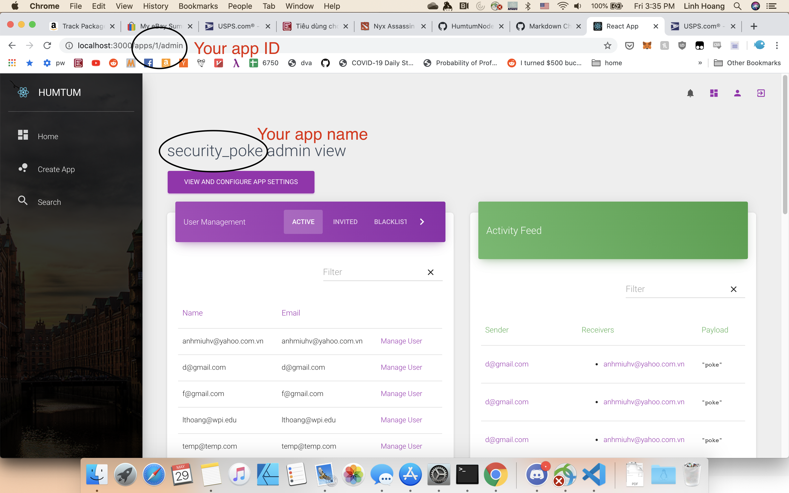

# Use the Humtum Platform to build Security Poke
## Start humtum-platform locally
To start:

* Clone the humtum source code
* Make sure you have rvm and yarn (Node.js) installed.
* Run rvm to install the ruby environment
```bash
rvm install 2.4.2
```
* After the rvm is installed, reenter the root project directory and run
```bash
bundle install
```
* Then goto the `./client` folder, then run
```bash
yarn install
```
* Go back to the root project directory, create `.env` file with the following content
```bash

export AUTH0_RUBY_CLIENT_ID=<Management API client ID>
export AUTH0_RUBY_CLIENT_SECRET=<Management API client Secret>>
```

* Run
```bash
source .env
```
* Run this to start the server
```bash

Rake db:migrate
Rake start
```
Now your humtum server should be running on localhost:3000

## Use humtum to create Security Poke backend

<iframe width="560" height="315" src="https://www.youtube.com/embed/NEyrtwj481Q" frameborder="0" allow="accelerometer; autoplay; encrypted-media; gyroscope; picture-in-picture" allowfullscreen></iframe>

After creating the app, remember your app name and app id.




## Create the Security Poke electron app
* Read the [overview](https://auth0.com/blog/securing-electron-applications-with-openid-connect-and-oauth-2/#Electron-Overview) about Electron.
* The source code for this example is [https://github.com/humtum-platform/HumtumNodeExample/tree/master/security-poke]

### Register Security Poke client application
* First, you need to register a client ID using humtum-platform OIDC dynamic client registration endpoint, for example
```bash
curl --location --request POST 'localhost:3000/clients' \
--header 'Content-Type: application/json' \
--data-raw '{
	"client_name": "Security poke",
	"redirect_uris": ["https://com.example.security-poke"]
}'
```
* The result will be like. Save your credential in a safe place.
```json
{
    "tenant": "humtum",
    "global": false,
    "is_token_endpoint_ip_header_trusted": false,
    "is_first_party": false,
    "oidc_conformant": true,
    "callbacks": ["https://com.example.security-poke"],
    "refresh_token": {
        "token_lifetime": 2592000,
        "leeway": 3,
        "rotation_type": "rotating",
        "expiration_type": "expiring"
    },
    "name": "Security poke",
    "sso_disabled": false,
    "cross_origin_auth": false,
    "encrypted": true,
    "signing_keys": "<keys>",
    "client_id": "<Client ID>",
    "callback_url_template": false,
    "client_secret": "<Client Secret>",
    "jwt_configuration": {
        "lifetime_in_seconds": 36000,
        "secret_encoded": false
    },
    "grant_types": ["authorization_code", "implicit", "refresh_token", "client_credentials"],
    "custom_login_page_on": true
}
```
### Implementing the Electron Client

Note: Our security poke example is a modification of [this blog](https://auth0.com/blog/securing-electron-applications-with-openid-connect-and-oauth-2/#Creating-the-Electron-Application). Read the blog before continue with this tutorial.

* Clone [this repo](https://github.com/humtum-platform/HumtumNodeExample)
* Go to `security-poke` folder. Run `npm i` to install all the dependencies.
* Create `env-variables.json` file for your application with the following
```json
{
  "apiIdentifier": "com.humtum.api.<YOUR-APP-NAME>",
  "auth0Domain": "humtum.auth0.com",
  "clientId": "<YOUR-CLIENT-ID>",
  "appId": "<YOUR-APP-ID>",
  "redirectUri": "<one-of-YOUR-redirect-uris>"
}
```
Note: Our app uses `keytar` to remember sensitive informations like the *refresh token* similar to the blog examples.

#### Authenticating Users in Electron Applications
Our example uses the [authorization code flow with pkce](https://auth0.com/docs/api-auth/tutorials/authorization-code-grant-pkce) and refresh token rotation enabled. In fact, all the clients that register through Humtum Platform has Refresh Token rotation enabled.

For this authorization flow, we need to implement in `./services/auth-service.js` the following functions:

* `getPKCEURLandSecret` : returns the complete URL of the Authorization Server that users have to visit to authenticate and the PKCE secret for the PKCE flow.
* `extractCode`: extract the code and the secret from callback URL returned by the Authorization Server
* `exchangeCodeForToken`: exchange the code from the Authorization Server for the access token and the refresh token. The refresh token needs to be stored securely on the device using keytar
* `refreshTokens`: use the refresh tokens to get the new access token


Code in `./main/auth-process.js` show how to authenticate using these functions

```javascript

const {BrowserWindow} = require('electron');
const authService = require('../services/auth-service');
const {createAppWindow} = require('../main/app-process');
const humtum = require('../services/humtum')
const envVariables = require('../env-variables');


let win = null;

function createAuthWindow() {
  destroyAuthWin();

  // Create the browser window.
  win = new BrowserWindow({
    width: 1000,
    height: 600,
  });
}

function authenticateUsingAuthWindow() {
  const { apiIdentifier, redirectUri } = envVariables
  const {
    url,
    secret
  } = authService.getPKCEURLandSecret({
    audience: apiIdentifier,
    scope: "openid email profile offline_access read:appdata write:appdata",
    redirect_uri: redirectUri
  })

  win.loadURL(url);

  const {session: {webRequest}} = win.webContents;

  const filter = {
    urls: [
      `${redirectUri}/*`
    ]
  };

  webRequest.onBeforeRequest(filter, async ({url}) => {
    try {
      const {code , state} = authService.extractCode(url)
      await authService.exchangeCodeForToken(code, secret, state)
      // await authService.loadTokens(url);

      await humtum.enrollInApp(envVariables.appId, (e) => {
        createAppWindow();
        destroyAuthWin();
      }).then(data => {

        if (data == null) return
        authenticateUsingAuthWindow();

      })
    } catch(error){
      console.error(error);

    };

  });

  win.on('authenticated', () => {

    destroyAuthWin();
  });

  win.on('closed', () => {
    win = null;
  });
}

function destroyAuthWin() {
  if (!win) return;
  win.close();
  win = null;
}

function createLogoutWindow() {
  return new Promise(resolve => {
    const logoutWindow = new BrowserWindow({
      show: false,
    });

    logoutWindow.loadURL(authService.getLogOutUrl());

    logoutWindow.on('ready-to-show', async () => {
      logoutWindow.close();
      await authService.logout();
      resolve();
    });
  });
}

module.exports = {
  createAuthWindow,
  createLogoutWindow,
  authenticateUsingAuthWindow
};
```

First, use function `getPKCEURLandSecret` to get the authentication url and secret. The options passed to the function needs to contain the following fields.

```javascript
{
    audience: apiIdentifier,
    scope: "openid email profile offline_access read:appdata write:appdata",
    redirect_uri: redirectUri
}
```

Then, load the URL using the Electron window. We need to set up a filter so that the browser window can call a callback function when the Authorization Server call the callback url with the code and secret when the user authenticates successfully. This callback function should `extractCode` from the callback url and the `exchangeCodeForToken` so that our authentication service can get the access token. Once this is successful, you can use the humtum.js function to call the Humtum-platform API. In this example, we check whether the user has enrolled into our app. If she has, the app window can be launch. Otherwise, enroll the user and then reauthenticate to get the user's permission to access her app's data.

Once the user is authenticated and enrolled, we can start building Security Poke!

### Implementing Security Poke.

Security Poke is an application that allows friends to poke each other about a security issue. Therefore, the MVP for our app would have the following functions:

* Friends list
* Add new friend
* Notifications for friends' request and poke
* Approve and reject friend's request
* Send a poke to other friends
* Show user's profile

All these functions are implemented in the `./renderers` folder. To be more specifically,

* use `humtum.getFriends` to get the friend list
* use `humtum.addFriend` to get send friend request
* use `humtum.approveFriendRequest` and `humtum.rejectFriendRequest` to approve and reject friend request
* use `humtum.createMessage` to send a poke using a predetermined format. For our apps, it is simple a string "poke"
* use `humtum.receiveMessage` to notify that the user has received the poke
* use `humtum.getMessage` to get unseen poke
* use `humtum.subscribeToChannel("MessagesChannel", ..., ... ,...)` to get the poke in real time using WebSocket
* use `humtum.getSelf` to get the user profile

## Conclusion
This tutorial shows how to build Security Poke using Humtum. The full source code for our application is in https://github.com/humtum-platform/HumtumNodeExample/tree/master/security-poke
